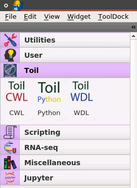

# BioDepot BWB Toil Plugin

Main Tool: https://github.com/BioDepot/BioDepot-workflow-builder

# Deployment:

We do not install Toil in Bwb containers to minimize the size of the container's image of Bwb. To use Toil without installation, we wrote a Docker file to build an image that consists of Toil, including the docker command-line tool (Docker CLI). Why do we need to have the Docker CLI? To leverage bioinformatics software without installation, we intend to use the Toil to call Docker containers using Docker images of those tools. We also need to map the volume of the "docker.sock" directory from the host machine. It is the UNIX socket that the Docker daemon is listening to and the main entry point for Docker API.

# How to install Toil plugin

1\. Clone the BioDepot-workflow-builder (BWB) first and then this repository.

```bash
git clone https://github.com/BioDepot/BioDepot-workflow-builder
git clone https://github.com/varikmp/biodepot_toil_widgets
```

2\. Run the plugin.sh script to install the Toil plugin for BWB. Specify the BioDepot BWB location that you cloned and the operation to install the plugin

```bash
./plugin.sh BWB_DIRECTORY OPERATION
./plugin.sh /home/biodepot/BioDepot-workflow-builder/ install
```

3\. Build or rebuild the container image with the Toil plugin included

```bash
./plugin.sh BWB_DIRECTORY OPERATION
./plugin.sh /home/biodepot/BioDepot-workflow-builder/ build
```

4\. Launch the container

```bash
./plugin.sh BWB_DIRECTORY OPERATION
./plugin.sh /home/biodepot/BioDepot-workflow-builder/ launch
```



When we see the Toil components on the left panel, that means we successfully installed the Toil plugin to the BWB. We are now ready to use the Toil widgets.

# How to use Toil widgets

1\. Click on the Toil CWL icon to create a Toil CWL/WDL/Python widget


